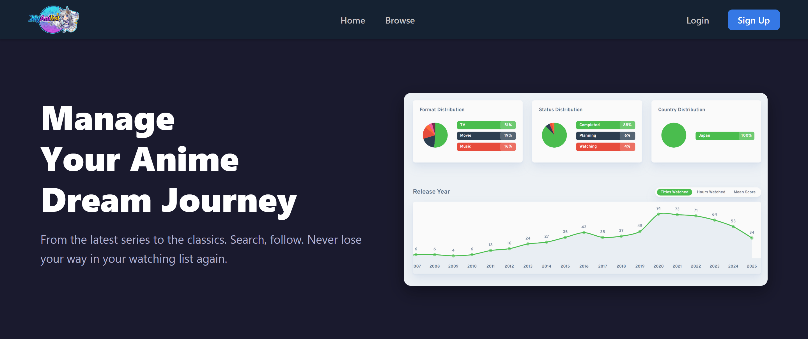
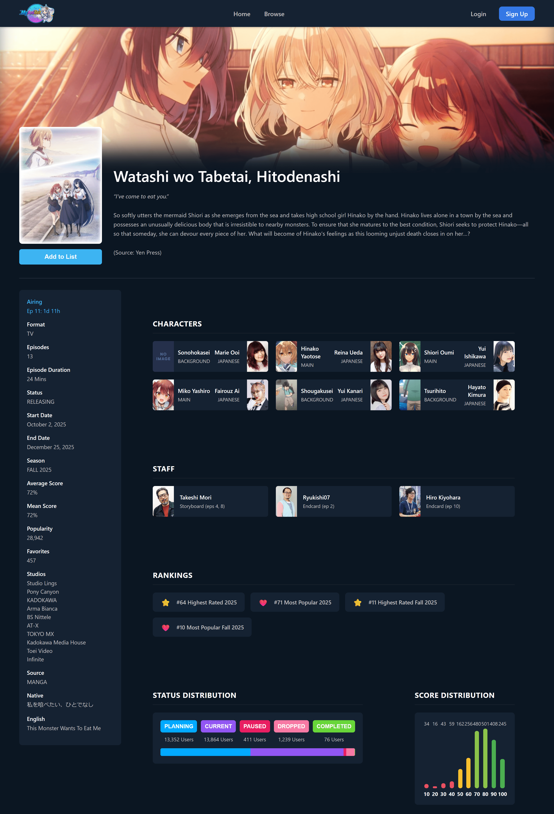
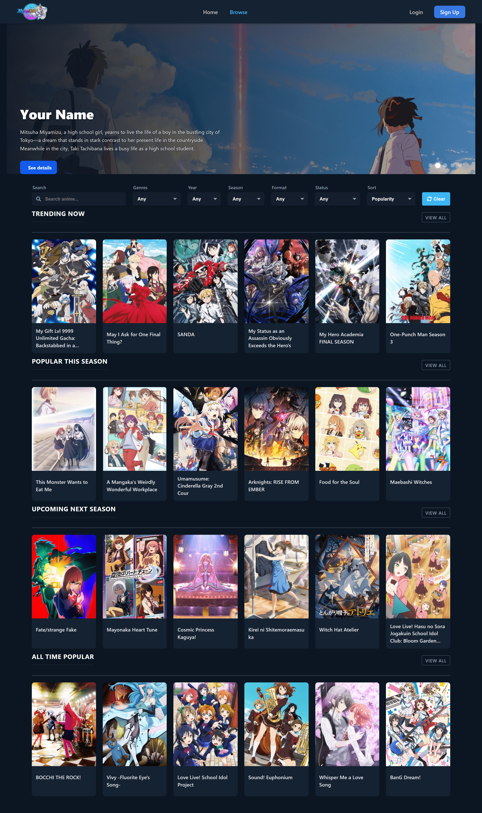
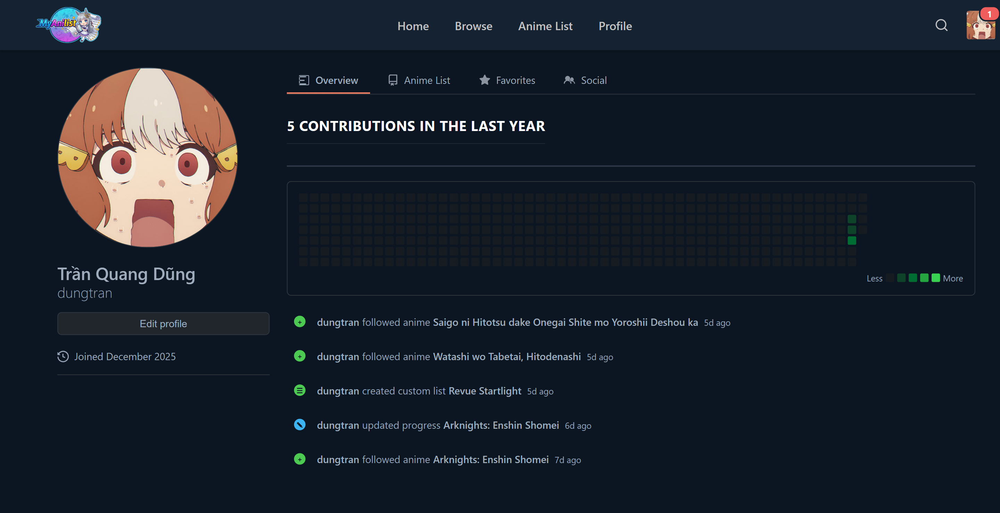
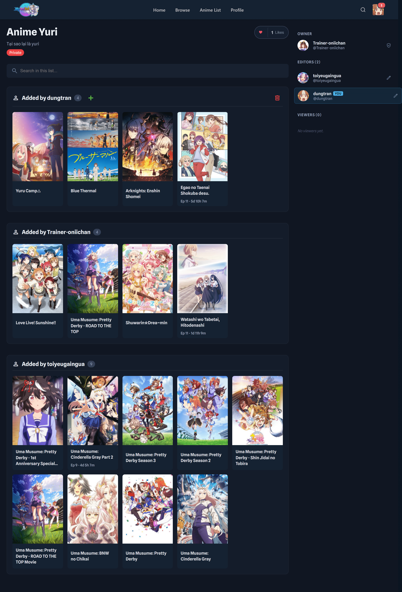
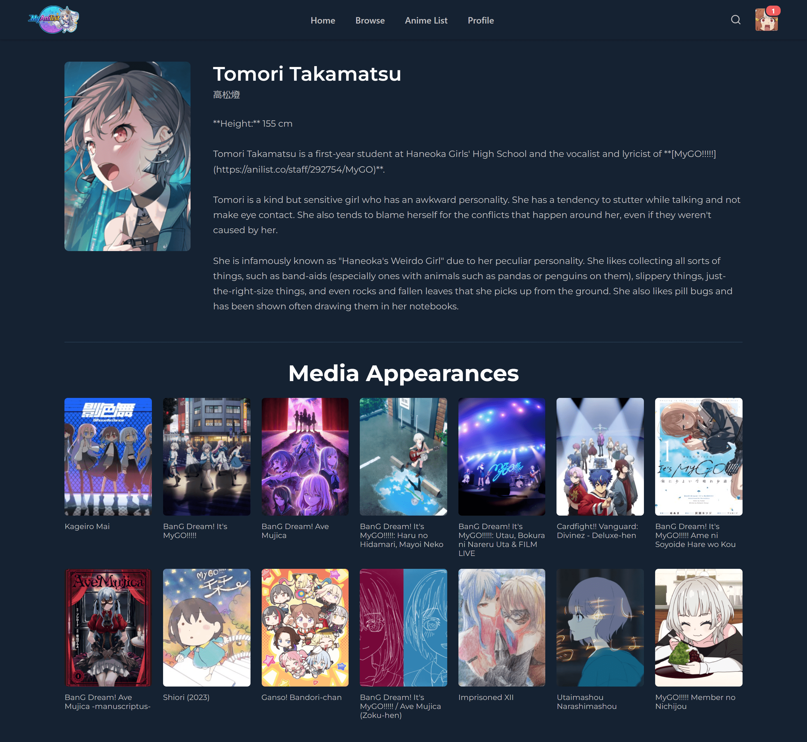

# MyAnilist Frontend

A modern, full-featured anime tracking web application built with React and Pure CSS. MyAnilist allows users to discover, track, and manage their anime watching experience with a clean, responsive interface inspired by popular anime databases.

🌐 **Live Demo**: [https://my-animelist-front.vercel.app/](https://my-animelist-front.vercel.app/)

## 🎯 Project Overview

MyAnilist is a comprehensive anime management platform that enables users to:
- Browse and search through an extensive anime database
- Track watching progress and create custom lists
- Discover trending and seasonal anime
- View detailed anime information including characters, staff, and statistics
- Manage personal profiles with activity feeds
- Receive notifications for upcoming episodes
- Interact with a community through shared lists and social features

## 🛠️ Tech Stack

### Core Technologies
- **React** (^18.3.1) - UI framework
- **React Router DOM** (^6.28.0) - Client-side routing
- **Pure CSS** - Custom styling (no CSS frameworks)

### Key Dependencies
- **React Big Calendar** (^1.16.2) - Calendar view for airing schedules
- **Moment.js** (^2.30.1) - Date manipulation
- **Axios** (^1.7.9) - HTTP client for API requests
- **React Toastify** (^10.0.6) - Toast notifications
- **Font Awesome** (^6.7.2) - Icon library

### Development Tools
- **React Scripts** (5.0.1) - Build tooling
- **Web Vitals** (^2.1.4) - Performance monitoring

## 📋 Prerequisites

Before you begin, ensure you have the following installed:

- **Node.js**: >= 16.x LTS (recommended: 18.x or 20.x)
- **npm**: >= 8.x (comes with Node.js) or **yarn**: >= 1.22.x
- **Backend API**: The backend should be running at `http://localhost:8000` (configurable)
  - Backend repository: [https://github.com/itsdoanguen/MyAnilist](https://github.com/itsdoanguen/MyAnilist)

## 🚀 Installation & Setup

> **💡 Quick Start**: You can try the live application at [https://my-animelist-front.vercel.app/](https://my-animelist-front.vercel.app/) without any installation.

### 1. Clone the Repository

```powershell
git clone https://github.com/UmaMusumeEnjoyer/MYAnimelist_front.git
cd myanilist_front
```

**Backend Repository**: The backend API is available at [https://github.com/itsdoanguen/MyAnilist](https://github.com/itsdoanguen/MyAnilist)

### 2. Install Dependencies

Using npm:
```powershell
npm install
```

Or using yarn:
```powershell
yarn install
```

### 3. Configure Environment Variables

Create a `.env` file in the root directory:

```env
REACT_APP_API_BASE_URL=http://localhost:8000
```

**Note**: All environment variables must be prefixed with `REACT_APP_` to be accessible in the React app.

### 4. Run Development Server

Start the development server with hot reload:

```powershell
npm start
```

Or with yarn:
```powershell
yarn start
```

The application will open at `http://localhost:3000` by default.

### 5. Build for Production

Create an optimized production build:

```powershell
npm run build
```

The build artifacts will be stored in the `build/` directory.

To serve the production build locally:
```powershell
npm install -g serve
serve -s build -l 3000
```

## 📁 Project Structure

```
myanilist_front/
├── public/
│   ├── images/              # Static images
│   ├── videos/              # Background videos
│   ├── index.html           # HTML template
│   ├── manifest.json        # PWA manifest
│   └── robots.txt           # SEO robots file
│
├── src/
│   ├── components/          # Reusable components
│   │   ├── Header.js
│   │   ├── Header.css
│   │   ├── AnimeCard.js
│   │   ├── AnimeCard.css
│   │   ├── GlobalSearchModal.js
│   │   └── VerifyEmail.js
│   │
│   ├── context/             # React Context providers
│   │   └── AuthContext.js   # Authentication context
│   │
│   ├── data/                # Mock data and constants
│   │   ├── animeSearchData.js
│   │   ├── FilterData.js
│   │   ├── mockDataSearchPage.js
│   │   └── newsData.js
│   │
│   ├── pages/               # Page components
│   │   ├── HomePage/
│   │   │   ├── HomePage.js
│   │   │   └── HomePage.css
│   │   ├── HomePageLogin/
│   │   ├── AnimeDetailPage/
│   │   │   ├── AnimeDetailPage.js
│   │   │   ├── AnimeDetailPage.css
│   │   │   └── components/  # Page-specific components
│   │   ├── AnimeListPage/
│   │   ├── AnimeSearch/
│   │   ├── ProfilePage/
│   │   ├── CharacterPage/
│   │   ├── StaffPage/
│   │   ├── CalendarPage/
│   │   ├── NewsDetailPage/
│   │   ├── AuthPage/
│   │   └── AnimeListSearch/
│   │
│   ├── services/            # API service layer
│   │   └── api.js           # API calls and caching
│   │
│   ├── utils/               # Utility functions
│   │   └── seasonUtils.js   # Season calculation helpers
│   │
│   ├── App.js               # Main app component
│   ├── App.css              # Global app styles
│   ├── index.js             # React entry point
│   └── index.css            # Global CSS imports
│
├── .gitignore
├── package.json
└── README.md
```

## ✨ Features

### 🏠 User Experience
- **Landing Page**: Hero sections with video backgrounds and feature showcases
- **Responsive Design**: Fully responsive layout using pure CSS Grid and Flexbox
- **Dark Theme**: Modern dark-themed UI optimized for extended viewing

### 🔐 Authentication
- **User Registration & Login**: Secure authentication system
- **Email Verification**: Account verification via email
- **OAuth Integration**: Social login support (Google, Facebook, GitHub, LinkedIn)
- **Protected Routes**: Context-based authentication state management

### 📺 Anime Features
- **Anime Search**: Advanced search with filters (genre, season, year, format, status)
- **Anime Details**: Comprehensive information including:
  - Synopsis and metadata
  - Character list with voice actors
  - Staff information
  - Episode tracking
  - Statistical distributions (status, scores)
  - Rankings and ratings
  - Trailer integration
- **Seasonal Browse**: Discover current and upcoming seasonal anime
- **Trending Lists**: View popular anime this season

### 📋 List Management
- **Personal Lists**: Create and manage custom anime lists
- **Status Tracking**: Track anime as Watching, Completed, Plan to Watch, On Hold, or Dropped
- **Progress Tracking**: Monitor episode progress with visual indicators
- **Score & Notes**: Rate anime and add personal notes
- **Private/Public Lists**: Control list visibility
- **Collaborative Lists**: Share lists with multiple editors and viewers
- **List Discovery**: Browse and like community anime lists

### 👤 Profile Management
- **User Profiles**: Customizable profiles with avatars and banners
- **Activity Feed**: View personal anime activity history
- **Activity Heatmap**: GitHub-style contribution heatmap for tracking engagement
- **Favorites**: Showcase favorite anime
- **Statistics**: View watching statistics and analytics

### 📅 Calendar
- **Airing Schedule**: Visual calendar showing upcoming episode releases
- **Notifications**: Email and in-app notifications for new episodes
- **Custom Events**: React Big Calendar integration with anime airing times

### 🔍 Discovery Features
- **Global Search**: Quick search modal accessible from any page
- **Genre Exploration**: Browse anime by genre categories
- **News Feed**: Latest anime news and articles
- **Character Pages**: Detailed character information and appearances
- **Staff Pages**: Voice actor and creator profiles

### 🎨 UI/UX Features
- **Loading States**: Smooth loading indicators and skeleton screens
- **Toast Notifications**: User feedback via React Toastify
- **Modal Dialogs**: Custom modal components for forms and details
- **Tabs & Navigation**: Intuitive tab-based navigation
- **Animated Transitions**: CSS transitions for enhanced user experience
- **Image Lazy Loading**: Optimized image loading for performance

### 🔧 Technical Features
- **Client-Side Routing**: React Router DOM for SPA navigation
- **API Caching**: Local storage caching for improved performance
- **Error Handling**: Graceful error handling with user-friendly messages
- **Responsive Images**: Adaptive image sizing for different devices
- **SEO Ready**: Meta tags and robots.txt configuration
- **PWA Support**: Progressive Web App manifest included

## 📸 Screenshots

### Landing Page

*Homepage with hero section, trending anime, and genre exploration*

### Anime Details

*Comprehensive anime information page with characters, staff, and statistics*

### Anime Search

*Advanced search with multiple filters and pagination*

### Profile Page

*User profile with activity feed, heatmap, and anime lists*

### Anime List Management

*Create and manage custom anime lists with progress tracking*

### Character Page

*Detailed character information with media appearances*

## 🎨 CSS Architecture

This project uses **Pure CSS** without any CSS frameworks. The styling is organized as follows:

- **Global Styles**: `src/index.css` and `src/App.css`
- **Component Styles**: Each component has its own CSS file (e.g., `src/components/Header.css`, `src/components/AnimeCard.css`)
- **Page Styles**: Each page has dedicated CSS (e.g., `src/pages/HomePage/HomePage.css`, `src/pages/AnimeDetailPage/AnimeDetailPage.css`)
- **CSS Modules**: Used for Staff and Character pages to avoid naming conflicts

### Design System
- **Color Palette**: Dark theme with accent colors (#3DB4F2, #007bff, #4CAF50)
- **Typography**: System fonts with Montserrat for special sections
- **Layout**: CSS Grid and Flexbox for responsive layouts
- **Animations**: CSS transitions and keyframe animations
- **Variables**: CSS custom properties for consistent theming

## 🔌 API Integration

The frontend communicates with a Django REST API backend. Key endpoints include:

- **Authentication**: `/api/auth/login/`, `/api/auth/register/`, `/api/auth/verify-email/`
- **Anime Data**: `/api/anilist/anime/<id>/`, `/api/anilist/search/name/`
- **User Lists**: `/api/user/<username>/anime-list/`, `/api/lists/`
- **Characters & Staff**: `/api/anilist/character/<id>/`, `/api/anilist/staff/<id>/`
- **Statistics**: `/api/anilist/anime/<id>/stats/`
- **Profile**: `/api/user/<username>/profile/`, `/api/user/avatar/upload/`

API calls are centralized in `src/services/api.js` with built-in caching and error handling.

## 🧪 Available Scripts

- **`npm start`** - Run development server
- **`npm test`** - Run test suite
- **`npm run build`** - Create production build
- **`npm run eject`** - Eject from Create React App (irreversible)

## 🐛 Troubleshooting

### CORS Errors
Ensure the backend has CORS properly configured. Install `django-cors-headers` and add the frontend origin to allowed origins.

### 404 on API Calls
Verify that:
- Backend is running at the URL specified in `.env`
- Backend routes match the frontend API calls
- Check backend logs for tracebacks

### Missing Data
Check backend logs and ensure:
- Database is properly migrated
- API returns expected JSON structure
- Network tab in DevTools shows successful responses

### Build Errors
- Clear node_modules: `rm -rf node_modules package-lock.json; npm install`
- Clear cache: `npm cache clean --force`
- Ensure Node.js version matches requirements

## 🤝 Contributing

1. Fork the repository
2. Create a feature branch (`git checkout -b feature/AmazingFeature`)
3. Commit your changes (`git commit -m 'Add some AmazingFeature'`)
4. Push to the branch (`git push origin feature/AmazingFeature`)
5. Open a Pull Request

## 📝 License

This project is part of a learning exercise. Check with the project owner for licensing information.

## 👥 Authors

- **UmaMusumeEnjoyer** - Initial work

## 🙏 Acknowledgments

- AniList API for anime data structure inspiration
- React community for excellent documentation
- All contributors who have helped shape this project
## 🔗 Links

- **Live Application**: [https://my-animelist-front.vercel.app/](https://my-animelist-front.vercel.app/)
- **Backend API Repository**: [https://github.com/itsdoanguen/MyAnilist](https://github.com/itsdoanguen/MyAnilist)
- **Frontend Repository**: [https://github.com/UmaMusumeEnjoyer/MYAnimelist_front](https://github.com/UmaMusumeEnjoyer/MYAnimelist_front)

---*Backend API**: [https://github.com/itsdoanguen/MyAnilist](https://github.com/itsdoanguen/MyAnilist)

---

**Note**: This is a frontend application that requires a backend API to function. Ensure the backend is properly configured and running before starting the frontend development server.
**Note**: This is a frontend application that requires a backend API to function. Ensure the backend is properly configured and running before starting the frontend development server.
